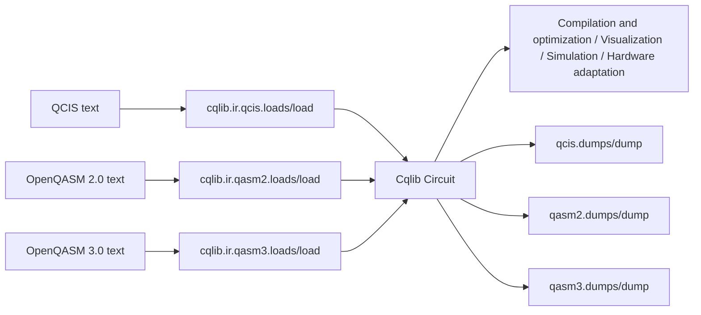

# Intermediate Representation (IR) overview

IR (Intermediate Representation) connects the `Circuit` objects inside Cqlib with external text formats. It is not a standalone algorithm module, but the protocol layer through which a quantum program flows between construction, storage, cross-toolchain exchange, hardware submission and debugging reproduction.

From a user perspective, the IR module mainly solves four kinds of problems:

- Exporting a `Circuit` built with Cqlib to a standard or hardware-related text format.
- Importing quantum circuit text generated by external tools as a Cqlib `Circuit`.
- Converting between the QCIS, OpenQASM 2.0 and OpenQASM 3.0 formats.
- Providing a unified entry point for subsequent compilation and optimization, visualization, simulation and hardware adaptation.

## 1. The IR working model of Cqlib

The core internal object of Cqlib is `Circuit`. An external text format (such as QCIS or OpenQASM) does not bypass `Circuit` to enter the simulator or the compiler directly; it is first parsed into a `Circuit`, and all subsequent modules work on the same set of circuit objects.



This means that the core semantics of IR are:

- `load/loads`: converts an external text format into a `Circuit`.
- `dump/dumps`: converts a `Circuit` into an external text format.
- Format conversion is essentially `format A -> Circuit -> format B`.
- If an external format has insufficient expressive power, exporting returns an explicit error instead of silently losing semantics.

## 2. Supported formats

| Format | Python module | Main use | Suitable scenario | Notes |
|---|---|---|---|---|
| QCIS | `cqlib.ir.qcis` | Circuit text oriented to hardware control instructions | Access to independently developed quantum hardware, low-level instruction exchange, QCIS file parsing | Expressive power leans toward the hardware instruction layer, and complex classical control flow is not supported |
| OpenQASM 2.0 | `cqlib.ir.qasm2` | Classical quantum assembly standard | Standard circuit files, benchmark circuits, interoperation with older OpenQASM toolchains | Classical semantics are limited, and `if (creg == int) qop` is mainly supported |
| OpenQASM 3.0 | `cqlib.ir.qasm3` | Modern quantum program text format | Dynamic circuits, measurement assignment, classical variables, control flow, interoperation with modern OpenQASM toolchains | The supported subset is bounded by what a Cqlib `Circuit` can express |

## 3. Unified API

All three IR submodules adopt the same API naming: `loads/dumps` for strings and `load/dump` for files.

| Function | Input | Output | Use |
|---|---|---|---|
| `loads(text)` | Format text string | `Circuit` | Parse a circuit from a string |
| `load(path)` | File path | `Circuit` | Parse a circuit from a file |
| `dumps(circuit)` | `Circuit` | String | Export a circuit as text |
| `dump(circuit, path)` | `Circuit`, file path | `None` | Write a circuit to a file |

Example:

```python
from cqlib import Circuit
from cqlib.ir import qasm2, qasm3, qcis

circuit = Circuit(2)
circuit.h(0)
circuit.cx(0, 1)

qasm2_text = qasm2.dumps(circuit)
qasm3_text = qasm3.dumps(circuit)
qcis_text = qcis.dumps(circuit)

restored = qasm3.loads(qasm3_text)
print(restored.num_qubits)
```

## 4. Measurement and classical data model of Cqlib IR

A Cqlib `Circuit` supports dynamic circuits, so measurement is not simply "drawing a measurement gate". Two kinds of classical data are distinguished internally:

| Concept | Meaning | Common source | User-writable |
|---|---|---|---|
| `ClassicalValue` | Immutable temporary result produced by measurement | `circuit.measure()`, `measure_bits()` | No |
| `ClassicalVar` | Mutable classical storage for users | `circuit.var(...)` | Yes |

For example:

```python
from cqlib import Circuit
from cqlib.circuit import ClassicalType

circuit = Circuit(2)

# only produces a measurement result value, without specifying a user variable.
measurement = circuit.measure(0)

# create a user-visible classical bit and write the measurement result into it.
bit = circuit.var(ClassicalType.bit())
circuit.measure_into(1, bit)
```

When exporting to OpenQASM, Cqlib folds internal measurement values into the natural form of the target format as far as possible:

| Cqlib operation | OpenQASM 3 output preference |
|---|---|
| `measure_into(q, bit)` | `c0 = measure q[0];` |
| `measure_bits_into([0, 1], bitvec)` | `c0 = measure q;` |
| Bare measurement `measure(q)` | Generates `bit[n] meas;` and writes into `meas[i]`, ensuring that the text can be read back |
| Partial register measurement | Outputs the form `c0[i] = measure q[j];`, preserving the order |

This part is one of the current focuses of IR modification in Cqlib: when exporting QASM3, internal temporary values are no longer exposed directly as meaningless `v0/v1`; instead, measurement targets that can be read back with clear semantics are generated.

## 5. Choosing a format

| Goal | Recommended format | Reason |
|---|---|---|
| Interoperation with public datasets or general tools | OpenQASM 2.0 or 3.0 | Common in the ecosystem and supported by many tools |
| Expressing modern dynamic circuits, measurement assignment and classical variables | OpenQASM 3.0 | More complete semantics than 2.0 |
| Hardware-instruction oriented or QCIS file delivery | QCIS | Closer to the hardware instruction format |
| Only storing a simple circuit to be read by old tools | OpenQASM 2.0 | Simple and stable |
| Preserving Cqlib-specific dynamic semantics | OpenQASM 3.0 preferred | Expressive power closer to `Circuit` |

## 6. Recommended reading order

1. Read [QCIS support](1_qcis.md) first to understand hardware-instruction-style text.
2. Then read [OpenQASM 2.0 support](2_qasm2.md) to master the most common standard format.
3. Then read [OpenQASM 3.0 support](3_qasm3.md) to understand measurement, classical variables and dynamic circuits.
4. Finally read the [format conversion workflow](4_conversion_workflow.md) to learn how to achieve cross-format interoperation and verification.
