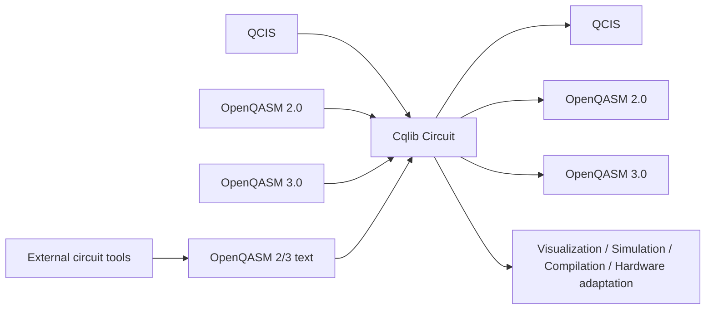

# Format conversion workflow

The IR module of Cqlib can serve as a conversion hub between QCIS, OpenQASM 2.0, OpenQASM 3.0 and external frameworks. All conversions follow the same principle:

```text
External format A -> Cqlib Circuit -> External format B
```

In other words, conversion is not string replacement: the input format is first parsed into a structured `Circuit`, and then the target format exporter regenerates the text.

## 1. Conversion overview



## 2. Converting QCIS to OpenQASM 3.0

When to use: converting a hardware-side or existing QCIS file into a modern standard format, for consumption by documentation systems, test tools or other OpenQASM tools.

```python
from cqlib.ir import qcis, qasm3

qcis_code = """
H Q0
CX Q0 Q1
M Q0 Q1
"""

circuit = qcis.loads(qcis_code)
qasm3_text = qasm3.dumps(circuit)
print(qasm3_text)
```

Typical output:

```text
OPENQASM 3.0;
include "stdgates.inc";

qubit[2] q;
bit[2] meas;

h q[0];
cx q[0],q[1];
meas[0] = measure q[0];
meas[1] = measure q[1];
```

Here `meas` is the explicit classical register that Cqlib supplies for QCIS measurement. QCIS has no measurement assignment syntax, but QASM3 does, so the exporter generates a target register that can be read back.

## 3. Converting OpenQASM 3.0 to QCIS

When to use: converting a standard QASM3 circuit into hardware-related QCIS instructions.

```python
from cqlib.ir import qasm3, qcis

qasm3_code = """
OPENQASM 3.0;
include "stdgates.inc";

qubit[2] q;
h q[0];
cz q[0],q[1];
"""

circuit = qasm3.loads(qasm3_code)
qcis_text = qcis.dumps(circuit)
print(qcis_text)
```

Output:

```text
H Q0
CZ Q0 Q1
```

If the QASM3 contains control flow, custom gates, complex classical assignment or a non-target gate set that QCIS cannot express, decomposition or compilation mapping is required first.

## 4. Converting OpenQASM 2.0 to OpenQASM 3.0

When to use: upgrading an old-format circuit, or converting a QASM2 benchmark into QASM3 to make it convenient to express subsequent dynamic measurement logic.

```python
from cqlib.ir import qasm2, qasm3

qasm2_code = """
OPENQASM 2.0;
include "qelib1.inc";
qreg q[2];
h q[0];
cx q[0],q[1];
"""

circuit = qasm2.loads(qasm2_code)
qasm3_text = qasm3.dumps(circuit)
print(qasm3_text)
```

## 5. Converting OpenQASM 3.0 to OpenQASM 2.0

When to use: output is needed for an old tool that supports only QASM2.

```python
from cqlib.ir import qasm3, qasm2

qasm3_code = """
OPENQASM 3.0;
include "stdgates.inc";

qubit[2] q;
h q[0];
cx q[0],q[1];
"""

circuit = qasm3.loads(qasm3_code)
qasm2_text = qasm2.dumps(circuit)
print(qasm2_text)
```

Note: the conversion succeeds only when the features used by the QASM3 circuit can also be expressed by QASM2. Complex `if/else`, `for`, `switch`, general classical assignment and similar constructs usually cannot be converted into QASM2 losslessly.

## 6. General way to convert between external tools and Cqlib

An external quantum circuit tool can exchange circuits with Cqlib in the same way as long as it can import or export OpenQASM text:

```text
External circuit object -> OpenQASM text -> cqlib.ir.qasm2/qasm3.loads -> Cqlib Circuit
```

```text
Cqlib Circuit -> cqlib.ir.qasm2/qasm3.dumps -> OpenQASM text -> External circuit object
```

Using OpenQASM text as the tool boundary is recommended, rather than coupling the internal circuit objects of both sides directly. This reduces the complexity of dependencies, and also makes it convenient to save input and output files in CI and perform regression tests.

If an external tool cannot read some Cqlib extension gates, the circuit can be decomposed into a more basic gate set on the Cqlib side first, and then exported.

## 7. Verification after conversion

After conversion, three kinds of verification are recommended.

### 7.1 Structural check

```python
print(circuit.num_qubits)
print(len(circuit.operations))
```

### 7.2 Visualization check

```python
from cqlib.visualization import draw_text

print(draw_text(circuit))
```

### 7.3 Small-scale unitary equivalence check

For a small circuit without measurement and dynamic control, matrices can be compared:

```python
import numpy as np
from cqlib.ir import qasm3

before = circuit.to_matrix()
restored = qasm3.loads(qasm3.dumps(circuit))
after = restored.to_matrix()

assert np.allclose(before, after)
```

A circuit containing measurement or control flow is not suitable for direct comparison of the overall unitary matrix; instead, the operation sequence, measurement targets, sampling results or backend execution results should be checked.

## 8. Format selection strategy

| Input source | Target | Recommended route |
|---|---|---|
| A QCIS file | General OpenQASM documentation or test file | `qcis.load -> qasm3.dump` |
| An external circuit tool | Cqlib simulation or compilation | `external tool exports OpenQASM -> cqlib.qasm2/qasm3.loads` |
| A Cqlib circuit | Old toolchain | `qasm2.dumps` |
| A Cqlib circuit | Modern toolchain or dynamic circuit | `qasm3.dumps` |
| A Cqlib circuit | Hardware instruction delivery | Compile to the target gate set first, then `qcis.dumps` |

## 9. Pre-conversion checklist

Before exporting, confirm:

- Whether the circuit contains a gate that the target format does not support.
- Whether there are unbound parameters.
- Whether complex classical control flow is present.
- Whether custom gates need `decompose()` first.
- Whether hardware topology mapping or target gate set decomposition is needed first.
- Whether measurement results need to be preserved, or whether it is purely drawing/simulation.

Example:

```python
compiled = circuit.decompose()
text = qasm3.dumps(compiled)
```

## 10. Common conversion issues

| Issue | Root cause | Suggestion |
|---|---|---|
| Extra `bit[n] meas` after converting QCIS to QASM3 | QCIS has no classical assignment, and QASM3 needs an explicit measurement target to ensure that it can be read back | Normal behavior, no need to delete |
| Conversion from QASM3 to QASM2 fails | The QASM3 uses dynamic semantics that QASM2 cannot express | Keep QASM3, or simplify the circuit |
| An external tool fails to read the OpenQASM exported by Cqlib | The target tool does not support some extension gates or syntax subsets | Decompose into basic gates first, or switch to a format supported by the target tool |
| QCIS export fails | The circuit contains a gate, Unitary, control flow or ordinary identity that QCIS does not support | Compile/decompose to a QCIS-supported gate set first |
| The text differs from the original after conversion | The exporter normalizes the text and does not preserve the layout and variable names | Take the circuit semantics as the standard, not exact string equality |

## 11. Recommended engineering practices

- Keep both the source format and the target format in the project, for traceability.
- Add unit tests for critical format conversions, covering at least `loads -> dumps -> loads`.
- Use matrix equivalence verification for simple unitary circuits.
- Check the measurement order and the classical target for circuits containing measurement.
- For a hardware submission path, verify the gate set, qubit numbering and measurement output with a small circuit first.

## Next steps

- [IR overview](0_overview.md)
- [QCIS support](1_qcis.md)
- [OpenQASM 2.0 support](2_qasm2.md)
- [OpenQASM 3.0 support](3_qasm3.md)
