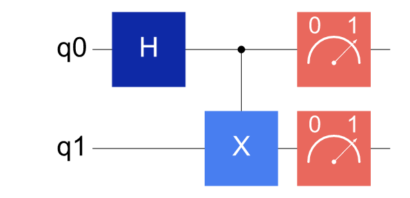
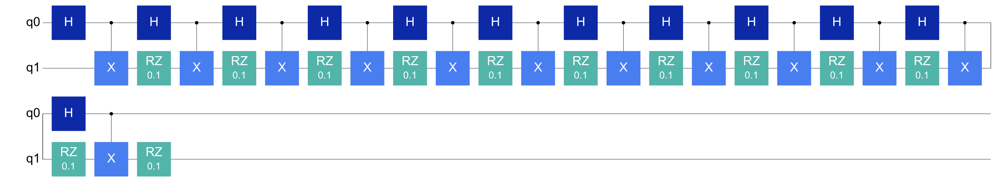
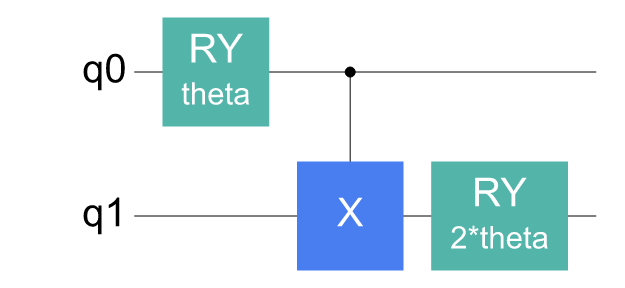
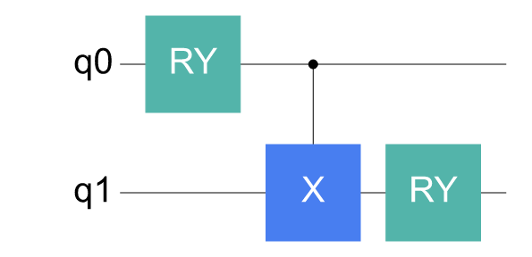
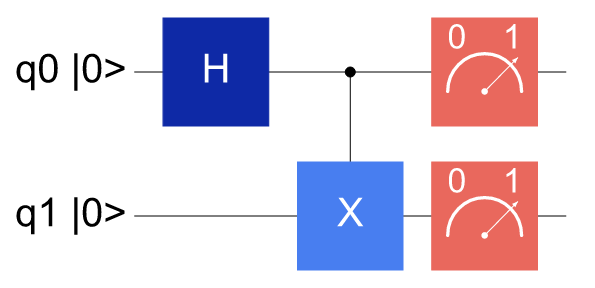
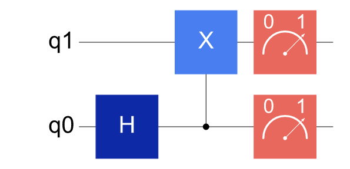
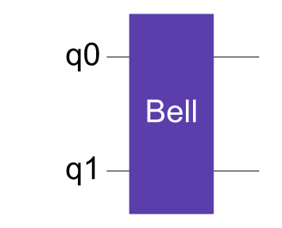
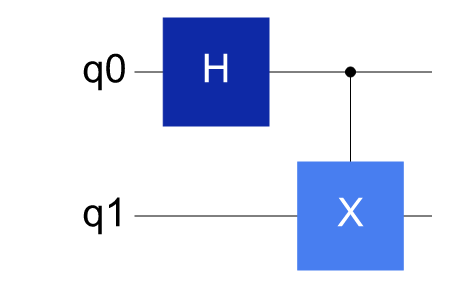

# Generating PNG circuit diagrams

PNG circuit diagrams are suitable for Gitee, Markdown, Notebooks, web documentation, reports and presentation material. Compared with text diagrams, figure-based circuits are better suited to showing more complex structures; when a vector graphic is needed, the export suffix can be changed to `.svg`.

---

## Task: save a Bell-state circuit diagram

```python
from cqlib import Circuit
from cqlib.visualization import draw_figure

circuit = Circuit(2)
circuit.h(0)
circuit.cx(0, 1)
circuit.measure(0)
circuit.measure(1)

svg = draw_figure(circuit, output_path="assets/bell.png")
print(svg[:80])
```

The generated result is as follows:



`draw_figure` returns an SVG string and also writes a file when `output_path` is passed. When `output_path` uses the `.png` suffix, a PNG file is written; the generated `assets/bell.png` can be placed directly in a Markdown, HTML, PPT or paper asset directory.

```markdown

```

---

## Inline display in a Notebook

In a Notebook, `draw_figure(circuit)` can be used as the last line of a cell for direct display.

```python
from cqlib.visualization import draw_figure

draw_figure(circuit)
```

When display must be controlled explicitly, it can be delegated to IPython:

```python
from IPython.display import SVG, display

display(SVG(draw_figure(circuit)))
```

If the same Notebook serves both exploration and the keeping of experiment records, passing `output_path` explicitly is recommended. The diagram seen in the Notebook and the PNG referenced in Markdown then come from the same piece of code.

---

## Folding long circuits

When a circuit is deep, laying it out flat makes the figure too wide. `fold` controls figure folding.

```python
deep = Circuit(2)
for _ in range(12):
    deep.h(0)
    deep.cx(0, 1)
    deep.rz(1, 0.1)

draw_figure(deep, fold=20, output_path="assets/deep_folded.png")
```

The folded circuit diagram is as follows:



Folding only changes the canvas layout, not the circuit execution order. When reading a folded diagram, follow the connection direction from the end of each segment to the start of the next.

---

## Controlling information density in figures

When a parameterized circuit shows all expressions in the figure, readability may suffer.

```python
from cqlib import Circuit, Parameter
from cqlib.visualization import draw_figure

theta = Parameter("theta")

ansatz = Circuit(2)
ansatz.ry(0, theta)
ansatz.cx(0, 1)
ansatz.ry(1, 2 * theta)

draw_figure(ansatz, output_path="assets/ansatz_with_params.png")
draw_figure(ansatz, show_params=False, output_path="assets/ansatz_structure.png")
```

The diagram with parameters kept:



The structure diagram with parameters hidden:



---

## Showing the initial state and bit order


```python
draw_figure(circuit, initial_state=True, output_path="assets/bell_initial_state.png")
```

The diagram with initial-state markers is as follows:



When alignment with the display conventions of a backend, a paper figure or other frameworks is needed, the display order can be reversed:

```python
draw_figure(circuit, reverse_bits=True, output_path="assets/bell_reverse_bits.png")
```

The diagram after reversing the display order is as follows:



These two options only affect figure display and do not change the gate order, bit indices or measurement semantics of `Circuit`.

---

## Decomposing composite gates for troubleshooting

Keeping composite gates as module boundaries is suitable for explaining algorithm structure; decomposing composite gates is suitable for troubleshooting the underlying gate sequence.

```python
block = Circuit(2)
block.h(0)
block.cx(0, 1)
bell_gate = block.to_gate("Bell")

main = Circuit(2)
main.append_circuit_gate(bell_gate, [0, 1])

draw_figure(main, output_path="assets/bell_gate.png")
draw_figure(
    main,
    decompose_circuit_gates=True,
    output_path="assets/bell_gate_decomposed.png",
)
```

The diagram with composite gate boundaries kept:



The diagram after decomposing composite gates:



---

## Next steps

- [Notebook and documentation integration](3_notebook_and_docs.md): fix the figure generation path, the asset directory and the Markdown references.
- [Visualization strategies for complex circuits](4_visualization_practices.md): show larger circuits with staged figures, module boundaries and before-and-after mapping comparison.
- [Control flow and special circuit structures](5_control_flow_and_special.md): read circuit diagrams that contain branches, loops, `reset`, `delay` and custom gates.
