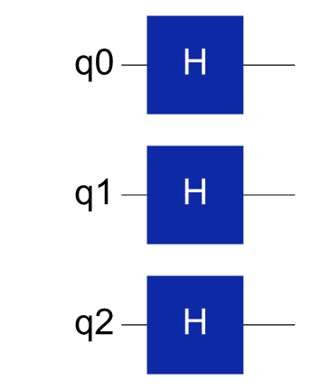
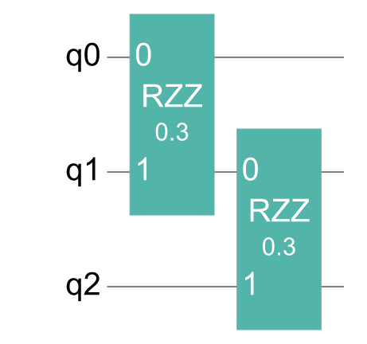
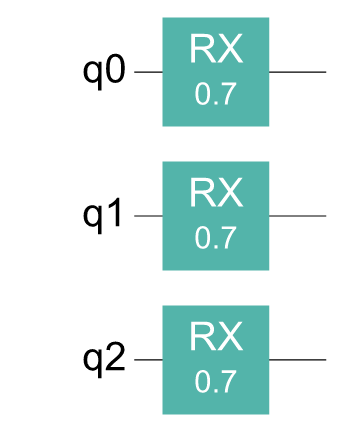
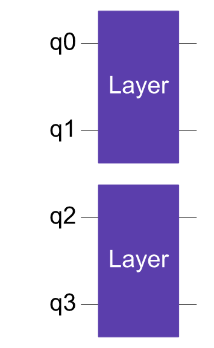
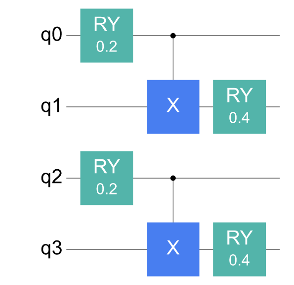
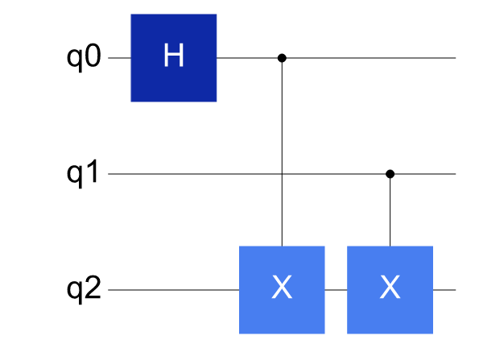
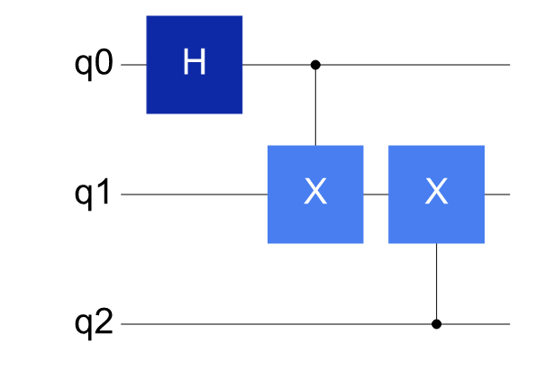

# Visualization strategies for complex circuits

When circuit size grows, drawing the whole circuit at once may be hard to read. A more practical approach is to inspect the key structures first, then use a small number of figures to compare scale-up, module decomposition or the changes before and after compilation and mapping.

---

## Task: showing a QAOA-style circuit in stages

First split the circuit into state preparation, the problem layer and the mixer layer:

```python
from cqlib import Circuit
from cqlib.visualization import draw_figure, draw_text

prepare = Circuit(3)
for q in range(3):
    prepare.h(q)

cost = Circuit(3)
cost.rzz(0, 1, 0.3)
cost.rzz(1, 2, 0.3)

mixer = Circuit(3)
for q in range(3):
    mixer.rx(q, 0.7)
```

Drawing each segment separately makes it easier to check that state preparation, the problem layer and the mixer layer are each correct.

```python
print(draw_text(prepare))
print(draw_text(cost))
print(draw_text(mixer))

draw_figure(prepare, output_path="assets/qaoa_prepare.png")
draw_figure(cost, output_path="assets/qaoa_cost.png")
draw_figure(mixer, output_path="assets/qaoa_mixer.png")
```

State preparation layer:



Problem layer:



Mixer layer:



A complete QAOA circuit can be composed of these modules repeated layer by layer. Checking the single-layer structure before extending the number of layers finds gate-order errors or errors in the qubits a gate acts on earlier.

---

## Showing module boundaries first, then decomposition details

For reusable modules such as ansatz, oracle and feature map, the `CircuitGate` boundary is usually kept first.

```python
block = Circuit(2)
block.ry(0, 0.2)
block.cx(0, 1)
block.ry(1, 0.4)
block_gate = block.to_gate("Layer")

ansatz = Circuit(4)
ansatz.append_circuit_gate(block_gate, [0, 1])
ansatz.append_circuit_gate(block_gate, [2, 3])

draw_figure(ansatz, output_path="assets/ansatz_modules.png")
draw_figure(
    ansatz,
    decompose_circuit_gates=True,
    output_path="assets/ansatz_decomposed.png",
)
```

The diagram with module boundaries kept:



The diagram after decomposing the modules:



With module boundaries kept, the hierarchical structure of the ansatz is easier to see; after decomposing composite gates, checking whether the underlying gate sequence matches expectations is easier.

---

## Before-and-after mapping comparison

In compilation and routing scenarios, the focus of the diagram is not the matrix of each gate but whether SWAPs are inserted and whether two-qubit gates satisfy the topology constraints.

```python
from cqlib.compile import compile
from cqlib.device import Device

original = Circuit(3)
original.h(0)
original.cx(0, 2)
original.cx(1, 2)

result = compile(
    original,
    device=Device.line("line-3", 3),
    target_basis=["H", "CX"],
    seed=42,
)
mapped = result.circuit

print("before")
print(draw_text(original, line_width=100))

print("after")
print(draw_text(mapped, line_width=100))

draw_figure(original, output_path="assets/mapped_before.png")
draw_figure(mapped, output_path="assets/mapped_after.png")
```

Before mapping:

```text

 Q0: ───H──■────
           │
 Q1: ──────┼──■─
           │  │
 Q2: ──────X──X─

```



After mapping:

```text

 Q0: ───H──■────
           │
 Q1: ──────X──X─
              │
 Q2: ─────────■─

```



When comparing the before-and-after diagrams, check whether SWAPs were added, whether the circuit depth increased and whether the relationship between logical qubits and physical qubits needs to be recorded.

If the mapping result depends on a random seed, heuristic search or device topology, the seed must be fixed and the topology used by the example must be recorded. Calibration, available qubits and gate error rates of real hardware devices change over time, so a single mapping result cannot be treated as a permanent guarantee.

---

## Showing only key slices of large circuits

For multi-layer ansatz or automatically generated circuits, the complete diagram is usually too wide. The following combination can be used to inspect key slices:

```python
print("num operations:", len(ansatz))
print(draw_text(ansatz, show_params=False, line_width=100))

draw_figure(
    ansatz,
    show_params=False,
    fold=80,
    output_path="assets/ansatz_overview.png",
)
```

The overview diagram is as follows:


Also record a small table:

| Content | Presentation |
|---|---|
| Single-layer structure | PNG circuit diagram |
| Layer count, gate count, depth | Table |
| Differences before and after compilation | Before-and-after comparison diagram |
| Parameter values | Separate table or formula |

This approach makes problems easier to locate than laying out dozens of circuit layers in full, and is better suited to experiment records or technical reports.

---

## Visualization cannot replace verification

Visualization is good at finding structural problems but cannot prove that a quantum program is correct. Key circuits should still be accompanied by numerical checks:

```python
from cqlib import Circuit
from cqlib.qis import Statevector

check = Circuit(2)
check.h(0)
check.cx(0, 1)

state = Statevector.from_circuit(check)
print(state.probabilities())
```

For workflows that involve random sampling, a fixed seed or tolerance-based comparison is also needed. For hardware execution workflows, results from a real device cannot be required to match an ideal simulation exactly; the effects of shot noise, topology mapping, gate errors and measurement errors should be described in the documentation.

The recommended combination is therefore: use text diagrams for quick checks on small circuits, save PNGs for key structures, and verify core conclusions with probabilities, matrices or test assertions. Visualization helps inspect structure and is not responsible for proving an algorithm correct on its own.

---

## Next steps

- [Control flow and special circuit structures](5_control_flow_and_special.md): apply the same diagram-reading method to dynamic control flow, non-unitary instructions and custom gates.
- [Visualizing execution results](6_result_visualization.md): after the circuit structure is confirmed, inspect sampling results with histograms and distributions.
- [Visualizing quantum states](7_state_visualization.md): when the state itself must be explained, supplement the structure diagram with Bloch, state city and Pauli vector figures.
