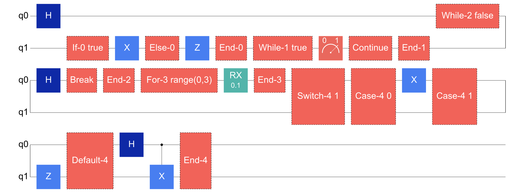
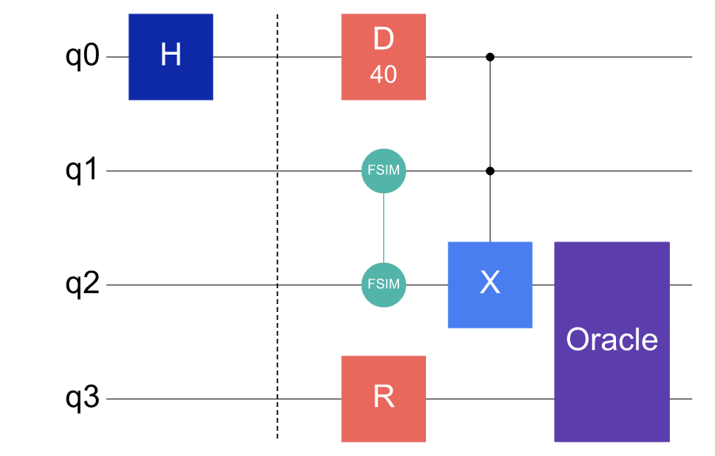

# Control flow and special circuit structures

Besides basic gates and ordinary parameterized circuits, Cqlib circuit diagrams can also display dynamic control flow, non-unitary instructions and custom gates. For such circuits, reading the diagram is not only about gate order: it also covers which qubit lanes a control-flow block spans, where a branch ends, whether a loop contains `break` / `continue`, and whether special gate labels preserve the algorithmic meaning.

The following examples only generate circuit diagrams and do not execute tasks on real hardware.

---

## Task: reading a dynamic control-flow diagram

First construct a dynamic circuit containing `if/else`, `while`, `for`, `switch`, `break` and `continue`. To keep the control-flow labels in the diagram short and stable, the diagram-reading example here uses literal conditions:

```python
from cqlib import Circuit
from cqlib.circuit import ClassicalExpr, ClassicalType
from cqlib.visualization import draw_figure

dynamic = Circuit(2)
dynamic.h(0)

def then_body(body):
    body.x(1)

def else_body(body):
    body.z(1)

dynamic.if_else(
    ClassicalExpr.bool_literal(True),
    then_body,
    else_body,
)

def continue_body(body):
    body.measure(1)
    body.continue_loop()

dynamic.while_(
    ClassicalExpr.bool_literal(True),
    continue_body,
)

def break_body(body):
    body.h(0)
    body.break_loop()

dynamic.while_(
    ClassicalExpr.bool_literal(False),
    break_body,
)

loop_var = dynamic.var(ClassicalType.uint(3))

def for_body(body, index):
    body.rx(0, 0.1)

dynamic.for_uint(
    loop_var,
    ClassicalExpr.uint_literal(3, 0),
    ClassicalExpr.uint_literal(3, 3),
    ClassicalExpr.uint_literal(3, 1),
    for_body,
)

def case_zero(body):
    body.x(0)

def case_one(body):
    body.z(1)

def switch_default(body):
    body.h(0)
    body.cx(0, 1)

def build_switch(builder):
    builder.value(0, case_zero)
    builder.value(1, case_one)
    builder.default(switch_default)

dynamic.switch(ClassicalExpr.uint_literal(2, 1), build_switch)

draw_figure(dynamic, fold=10, output_path="assets/dynamic_control_flow.png")
```

The generated control-flow circuit diagram is as follows:



Reading this diagram, each control-flow block can be checked in turn:

- The `If`, `Else` and `End` markers give the entry, alternative branch and end position of a conditional branch;
- The first `While` block uses a `true` condition, and the `Continue` at the end of the loop body means the next loop check is entered;
- The second `While` block contains `Break`, meaning the loop body can exit the innermost loop directly;
- The `For` block shows the loop range, making the iteration bounds easy to confirm;
- The `Switch` block shows the selector expression and lists the case and default branches;
- The vertical extent of a control-flow block corresponds to the qubit lanes actually used by the body; lanes not involved in that body must not be misread as being operated on by the control block.

Conditions in real dynamic circuits usually come from mid-circuit measurement or classical storage, as written below:

```python
from cqlib import Circuit
from cqlib.circuit import ClassicalExpr, ClassicalType, Instruction, StandardGate
from cqlib.compile import compile
from cqlib.device import Device

dynamic = Circuit(2)
dynamic.h(0)
measured = dynamic.measure(0)
condition = measured.expr().to_bool()

def then_body(body):
    body.x(1)

def else_body(body):
    body.z(1)

dynamic.if_else(condition, then_body, else_body)

keep_running = dynamic.var(ClassicalType.bool())
dynamic.store(keep_running, ClassicalExpr.bool_literal(True))

def loop_body(body):
    loop_measurement = body.measure(1)
    body.store(keep_running, loop_measurement.expr().to_bool())
    body.continue_loop()

dynamic.while_(keep_running.expr(), loop_body)

device = Device.line("line-2", 2)
device.native_gates = [
    Instruction.from_standard_gate(StandardGate.H),
    Instruction.from_standard_gate(StandardGate.X),
    Instruction.from_standard_gate(StandardGate.Z),
]
compiled = compile(dynamic, device=device, seed=42)
```

Layout and routing treat a control-flow body as a structured sub-circuit and recursively process the gates and control-transfer markers in the body. The circuit diagram only expresses structure, branch positions and control-flow boundaries; it does not express which path a single runtime execution actually takes, nor does it estimate branch probabilities or loop counts.

---

## Task: reading special instructions and non-basic gates

The following circuit contains `barrier`, `delay`, `reset`, `fSim`, a multi-controlled gate and a custom `UnitaryGate` at the same time:

```python
from cqlib import Circuit
from cqlib.circuit import MCGate, StandardGate, UnitaryGate
from cqlib.visualization import draw_figure

special = Circuit(4)
special.h(0)
special.barrier([0, 1, 2, 3])
special.delay(0, 40.0)
special.fsim(1, 2, 0.21, -0.44)
special.reset(3)

special.append_mc_gate(MCGate(2, StandardGate.X), [0, 1, 2])
special.append_unitary_gate(UnitaryGate("Oracle", 2), [2, 3])

draw_figure(special, output_path="assets/special_directives_and_gates.png")
```

The generated circuit diagram is as follows:



This diagram helps check several common issues:

- `barrier` is a vertical line that preserves segmentation or scheduling boundaries and does not represent a quantum gate;
- `delay` shows the waiting duration, which suits checking hardware timing or idle segments;
- `reset` is shown as a re-preparation to `|0>`; it is a non-unitary instruction;
- `fSim` is a two-qubit parameterized gate and spans the two qubits it acts on in the diagram;
- Multi-controlled gates are drawn in the order of control qubits first and target qubits after;
- A custom `UnitaryGate` displays the label supplied for it in preference, such as `Oracle` here.

If a custom gate or composite gate label is too long, the figure can still show the structure, but whether the label expresses the meaning of the algorithm module well enough should be confirmed when reading. For scenarios that require troubleshooting at the level of the underlying gate sequence, refer back to the `decompose_circuit_gates=True` example in [Generating PNG circuit diagrams](2_draw_figure.md).

---

## Next steps

- [Generating PNG circuit diagrams](2_draw_figure.md): return to the basic drawing options and adjust folding, parameter display, initial-state markers and composite gate decomposition.
- [Visualization strategies for complex circuits](4_visualization_practices.md): when control flow or special gates are placed into a larger algorithm circuit, use segmentation and comparison figures to keep it readable.
- [Visualizing execution results](6_result_visualization.md): after execution or sampling, inspect the bitstring distribution produced by a dynamic circuit with result figures.
