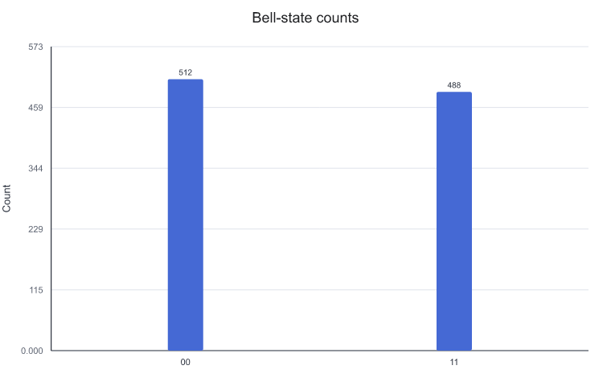
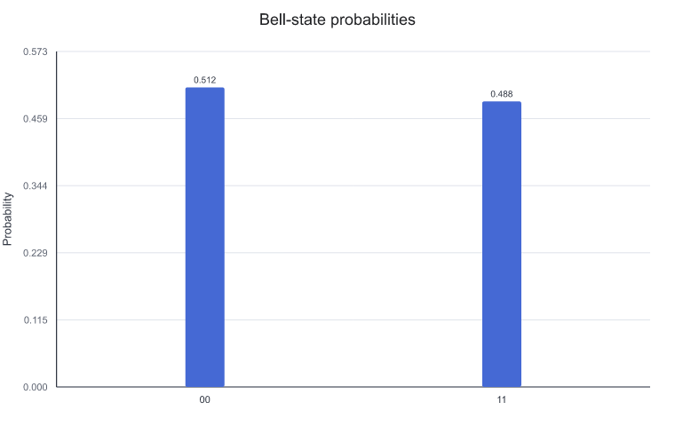
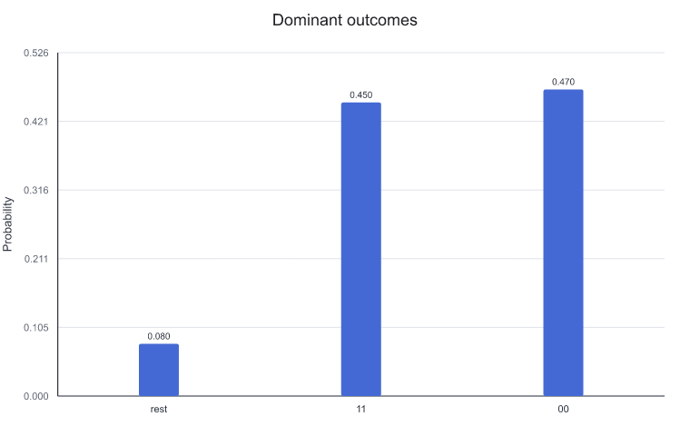
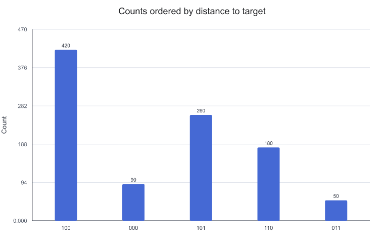
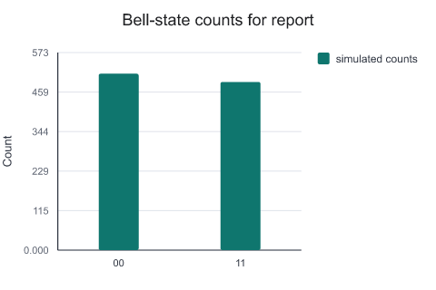

# Visualizing execution results

A constructed `ExecutionResult` is used below to show how to plot sampling counts and normalized probability distributions.

A locally constructed result object is used here; no cloud platform is connected and no task is submitted to real hardware.

---

## Task: inspecting Bell-state sampling results

After real execution or simulation sampling, a mapping from bitstrings to counts is usually obtained. Here the result object is constructed directly from counts so that the focus stays on how to read the result figures.

```python
from cqlib.device import ExecutionResult
from cqlib.visualization import plot_distribution, plot_histogram

counts = {"00": 512, "11": 488}

result = ExecutionResult.from_counts(
    "bell-demo",
    [0, 1],
    sum(counts.values()),
    2,
    counts,
)
```

`counts` means that only `00` and `11` were observed in 1000 shots. The bitstrings are written directly here according to the display convention of the result object; if the result comes from hardware or another SDK, the mapping from measurement bits to bitstrings must be confirmed first. For an ideal Bell state, `00` and `11` should be the dominant peaks, and `01` and `10` should not appear with high probability.

---

## Plotting the raw counts bar chart

```python
plot_histogram(
    result,
    title="Bell-state counts",
    output_path="assets/bell_counts.png",
)
```

The generated counts figure is as follows:



The counts figure is suitable for showing real shot counts. When comparing the raw sampling volume across different shot settings, hardware tasks or before and after error mitigation, prefer the histogram. When reading the figure, look at the dominant peaks first and then check whether bitstrings that should not appear are present.

---

## Plotting the probability distribution

```python
plot_distribution(
    result,
    title="Bell-state probabilities",
    output_path="assets/bell_distribution.png",
)
```

The generated probability distribution is as follows:



The probability distribution normalizes the counts and is better suited to comparison with theoretical probabilities. For a Bell state, the ideal distribution should be close to:

```text
P(00) = 0.5
P(11) = 0.5
P(01) = 0.0
P(10) = 0.0
```

When a small number of `01` or `10` results appear in an experiment, the circuit should not immediately be judged faulty. The judgment should combine the shot count, noise model, measurement error and backend information.

---

## Keeping dominant peaks and merging the long tail

When only the most frequent items are to be kept, the number displayed can be limited. The remaining items are merged, which makes the dominant peaks easier to see.

```python
noisy_counts = {
    "00": 470,
    "11": 450,
    "01": 45,
    "10": 35,
}

noisy_result = ExecutionResult.from_counts(
    "bell-noisy-demo",
    [0, 1],
    sum(noisy_counts.values()),
    2,
    noisy_counts,
)

plot_distribution(
    noisy_result,
    number_to_keep=2,
    sort="desc",
    title="Dominant outcomes",
    output_path="assets/bell_dominant_outcomes.png",
)
```

The figure after keeping only the dominant peaks is as follows:



When using this kind of figure, confirm what the merged results are and whether this affects the conclusion. `number_to_keep` is suitable for reporting the dominant-peak structure but not for hiding error terms; if low-probability items are themselves the focus of the analysis, show the full distribution or list the merged counts separately.

---

## Marking a target outcome

When debugging search algorithms or classification tasks, a particular target bitstring often needs to be emphasized. `target_string` can mark the target item and sort by Hamming distance.

```python
search_counts = {
    "100": 420,
    "101": 260,
    "110": 180,
    "000": 90,
    "011": 50,
}

search_result = ExecutionResult.from_counts(
    "search-demo",
    [0, 1, 2],
    sum(search_counts.values()),
    3,
    search_counts,
)

plot_histogram(
    search_result,
    sort="hamming",
    target_string="100",
    title="Counts ordered by distance to target",
    output_path="assets/search_hamming_counts.png",
)
```

The figure sorted by distance to the target is as follows:



This kind of figure is suitable for checking whether results concentrate near the target. The definition of the target bitstring and the measurement bit order must be clarified before use.

---

## Generating result figures for reports

When a result figure is to be put into a report or presentation material, the canvas size, colors, legend and bar label display can all be controlled. The same set of Bell-state counts is still used below; only the figure presentation is adjusted:

```python
plot_histogram(
    result,
    figsize=(4.8, 3.2),
    color=["#0f766e"],
    legend=["simulated counts"],
    bar_labels=False,
    title="Bell-state counts for report",
    output_path="assets/bell_report_counts.png",
)
```

The generated report counts figure is as follows:



These settings suit material with many figures and limited layout space. With `bar_labels` disabled, the figure is more concise; if specific counts need to be reviewed item by item, keep the raw result data as well or use the default figure with labels.

---

## Key points for checking result figures

- Confirm whether the results come from simulation, constructed data or real hardware;
- Record the shot count rather than only looking at normalized probabilities;
- Keep error and noise explanations for hardware results rather than attributing deviations simply to circuit errors;
- When comparing with a theoretical distribution, confirm the bitstring order and the measurement mapping first;
- For a formal report, both the PNG figure and the raw counts data can be saved.

---

## Next steps

- [Visualizing quantum states](7_state_visualization.md): when the simulated state itself must be explained, supplement the sampling results with Bloch, state city and Pauli vector figures.
- [Notebook and documentation integration](3_notebook_and_docs.md): save the result figures, the raw counts and the image references together in the experiment records.
- [Visualization strategies for complex circuits](4_visualization_practices.md): check result figures and circuit diagrams side by side to confirm whether a structural change explains a distribution change.
