# Visualizing quantum states

State figures are used to understand quantum states themselves rather than measurement sampling results. Cqlib currently supports drawing a Bloch multivector, state city and Pauli vector from a `Statevector` or `DensityMatrix`, and also supports drawing a single Bloch vector directly.

The following examples are all completed in local simulation and do not involve real hardware.

---

## Task: observing a single-qubit superposition state

First construct a `|+>` state:

```python
from cqlib.qis import Statevector
from cqlib.visualization import (
    plot_bloch_multivector,
    plot_bloch_vector,
    plot_state_city,
    plot_state_paulivec,
)

state = Statevector(1)
state.apply_h(0)
```

The `|+>` state lies along the positive X axis on the Bloch sphere, so a Bloch figure can be used to quickly check whether state preparation matches expectations. The state object here comes from a local `Statevector`, not from sampling counts.

```python
plot_bloch_multivector(
    state,
    title="|+> state",
    output_path="assets/plus_bloch.png",
)
```

The generated Bloch figure is as follows:

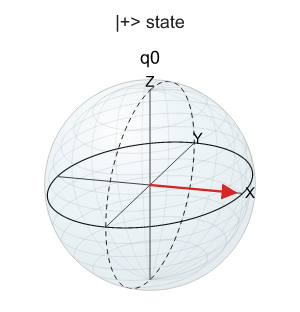

To draw a manually supplied Bloch vector, a three-dimensional vector can be passed directly:

```python
plot_bloch_vector(
    [1.0, 0.0, 0.0],
    title="Bloch vector along +X",
    output_path="assets/bloch_x.png",
)
```

The Bloch figure corresponding to the manual vector is as follows:

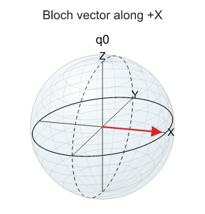

Passing a three-dimensional vector manually is suitable for explaining Bloch sphere directions; when drawing from a circuit or a state object, `plot_bloch_multivector` should be preferred, to avoid convention errors introduced by manual vector computation.

---

## Inspecting the density matrix structure

`plot_state_city` shows the real and imaginary parts of the density matrix. It is suitable for checking whether coherence terms exist in the state and whether the mixed-state or pure-state structure matches expectations.

```python
plot_state_city(
    state,
    title="State city for |+>",
    output_path="assets/plus_state_city.png",
)
```

The generated state city figure is as follows:

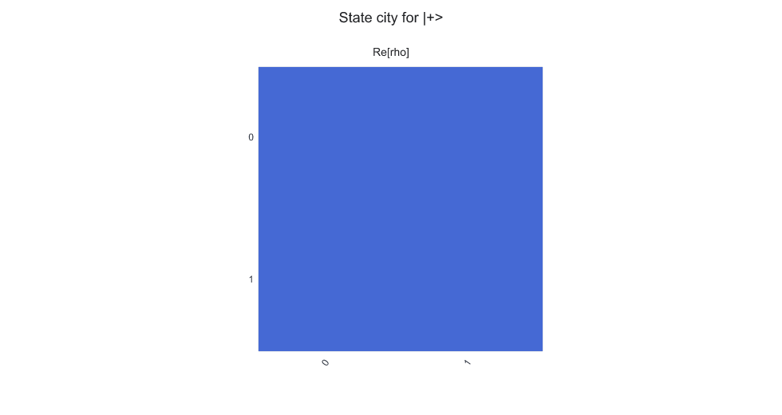

For `|+>`, the off-diagonal elements of the density matrix are non-zero, indicating coherence between `|0>` and `|1>`.

---

## Inspecting the Pauli expansion

The Pauli vector shows the expectation values of the state in the Pauli basis and suits connection to VQE, QAOA, error diagnosis and observable analysis.

```python
plot_state_paulivec(
    state,
    title="Pauli vector for |+>",
    output_path="assets/plus_paulivec.png",
)
```

The generated Pauli vector figure is as follows:

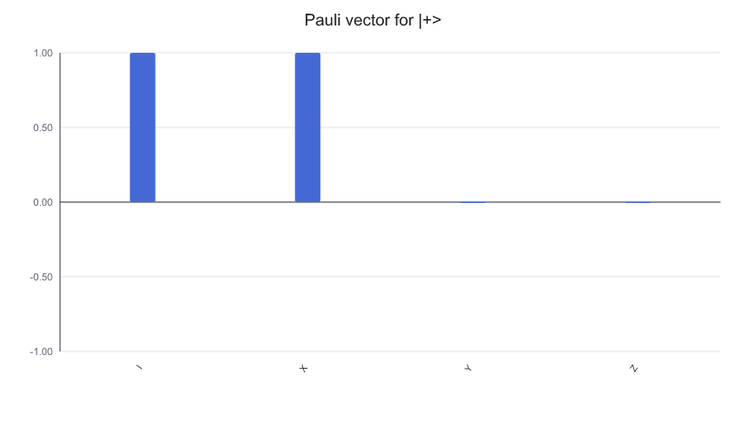

For the `|+>` state, the expectation value along `X` should be the dominant term. This kind of figure explains the physical meaning better than looking at complex amplitudes directly.

---

## Statevector and DensityMatrix share the same set of state figures

The same pure state can also be written as a density matrix. The state visualization interfaces of Cqlib accept `Statevector` and `DensityMatrix`, so the same drawing logic can compare an ideal state and a noisy state.

```python
from cqlib.qis import DensityMatrix

density = DensityMatrix(1)
density.apply_h(0)

plot_state_city(density, output_path="assets/plus_density_city.png")
plot_state_paulivec(density, output_path="assets/plus_density_paulivec.png")
```

The figures generated from density matrix input are as follows:

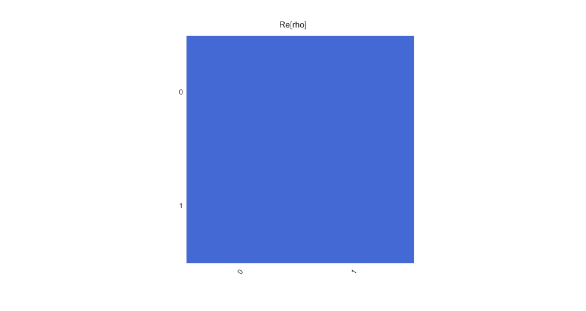

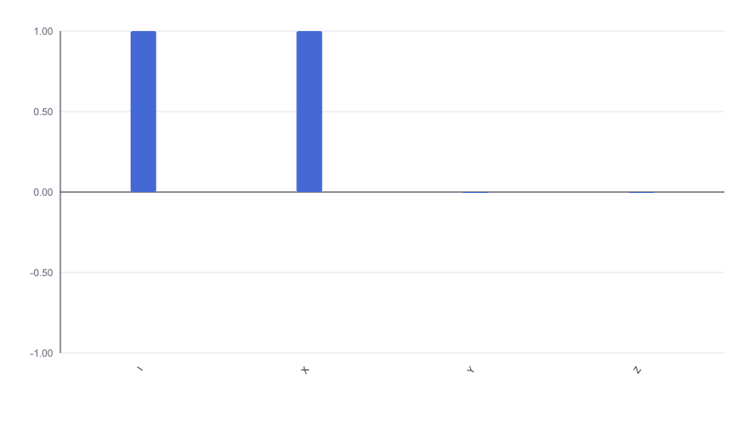

When using state figures, whether the input is a statevector or a density matrix must be clarified first. The former usually represents an ideal pure state, while the latter can express mixed states and states after noise.

A simple mixed state is constructed below to show how the state city exposes the diagonal structure:

```python
mixed = DensityMatrix.from_density_matrix(
    1,
    [
        0.7 + 0.0j,
        0.0 + 0.0j,
        0.0 + 0.0j,
        0.3 + 0.0j,
    ],
)

plot_state_city(
    mixed,
    title="Mixed one-qubit state",
    output_path="assets/mixed_state_city.png",
)
```

The state city of the mixed state is as follows:

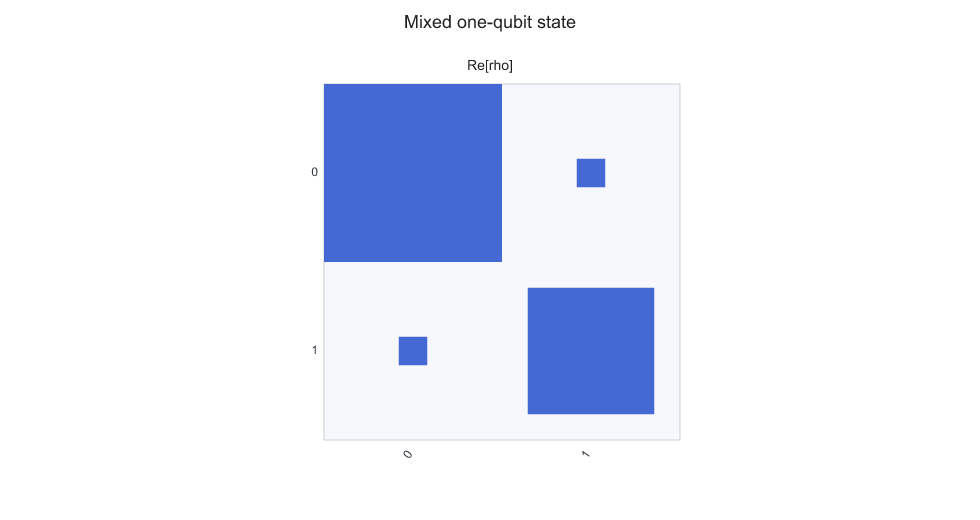

This example has no off-diagonal coherence terms, so the main information in the figure is concentrated in the diagonal elements. Comparing it with the state city of `|+>` shows the difference between a coherent state and a classical probability mixture directly.

---

## How to read multi-qubit states

For multi-qubit states, the Bloch multivector draws a reduced Bloch vector for each qubit. Taking the Bell state as an example:

```python
from cqlib import Circuit
from cqlib.qis import Statevector
from cqlib.visualization import plot_bloch_multivector, plot_state_city

bell = Circuit(2)
bell.h(0)
bell.cx(0, 1)

bell_state = Statevector.from_circuit(bell)

plot_bloch_multivector(bell_state, output_path="assets/bell_bloch_multivector.png")
plot_state_city(bell_state, output_path="assets/bell_state_city.png")
```

The reduced Bloch figure of the Bell state is as follows:

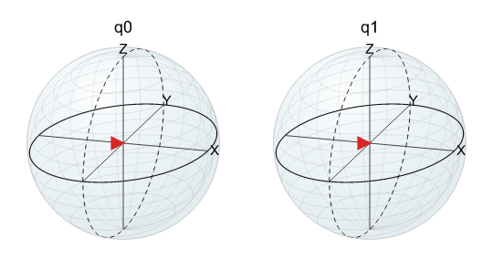

The state city figure of the Bell state is as follows:

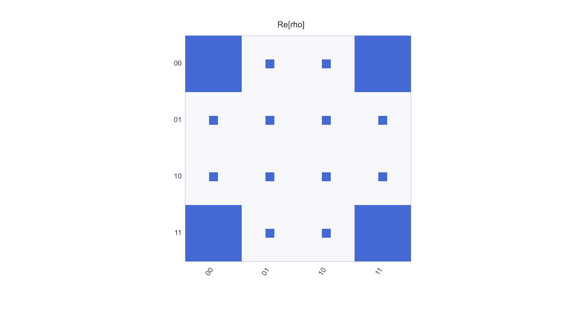

For a maximally entangled state, the reduced state of a single qubit may look close to a mixed state. In this case the global state must not be judged as carrying no information from a single Bloch sphere alone; the state city, probability distribution or entanglement measures should be analyzed together.

Read only from the local Bloch vector of each qubit, the Bell state appears to have no direction; the state city, however, still shows the correlation structure in the global density matrix. Multi-qubit states therefore usually need several kinds of state figure together for a judgment.

---

## Checking the multi-qubit label order

The horizontal-axis labels of a multi-qubit state city and Pauli vector depend on the bit order. When alignment with the display conventions of a paper, a hardware backend or other SDKs is needed, `reverse_bits=True` can generate a comparison figure.

An asymmetric two-qubit diagonal density matrix is constructed below, so that `01` and `10` have different weights:

```python
asymmetric = DensityMatrix.from_density_matrix(
    2,
    [
        0.05 + 0.0j, 0.0 + 0.0j, 0.0 + 0.0j, 0.0 + 0.0j,
        0.0 + 0.0j, 0.15 + 0.0j, 0.0 + 0.0j, 0.0 + 0.0j,
        0.0 + 0.0j, 0.0 + 0.0j, 0.75 + 0.0j, 0.0 + 0.0j,
        0.0 + 0.0j, 0.0 + 0.0j, 0.0 + 0.0j, 0.05 + 0.0j,
    ],
)

plot_state_city(
    asymmetric,
    title="Asymmetric basis weights",
    output_path="assets/asymmetric_state_city.png",
)
plot_state_city(
    asymmetric,
    reverse_bits=True,
    title="Asymmetric basis weights, reversed bits",
    output_path="assets/asymmetric_state_city_reverse_bits.png",
)
```

State city with the default display order:

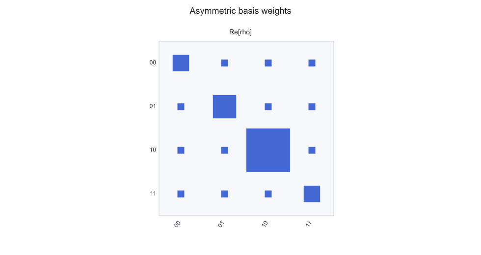

State city after reversing the display order:

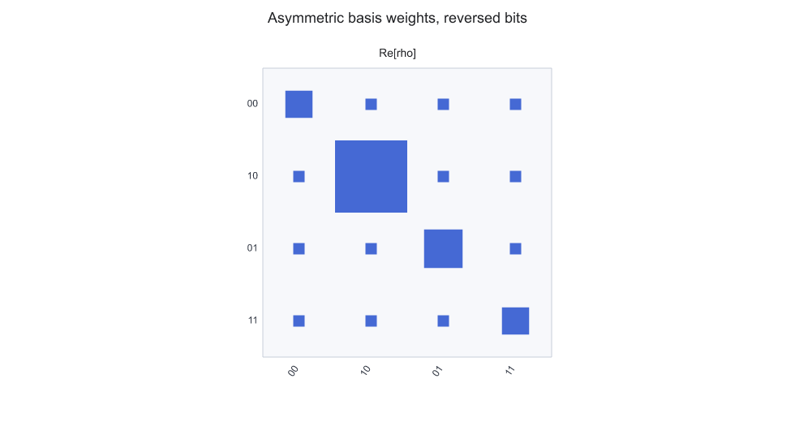

`reverse_bits=True` does not change the state itself, only the display order of the basis labels in the figure. For this asymmetric state, `01` and `10` have different weights, so reversing the labels directly affects the conclusion drawn from the figure.

The Pauli vector can be generated for comparison in the same way:

```python
plot_state_paulivec(
    asymmetric,
    title="Asymmetric Pauli vector",
    output_path="assets/asymmetric_paulivec.png",
)
plot_state_paulivec(
    asymmetric,
    reverse_bits=True,
    title="Asymmetric Pauli vector, reversed bits",
    output_path="assets/asymmetric_paulivec_reverse_bits.png",
)
```

Default Pauli vector:

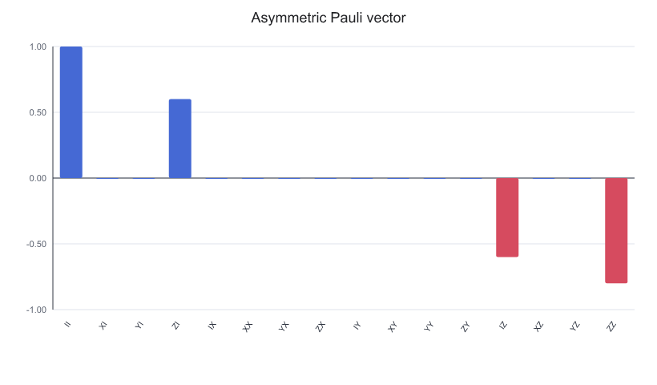

Pauli vector after reversing the display order:

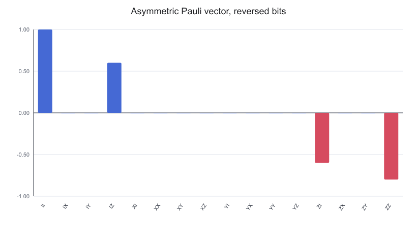

In multi-qubit state figures, confirm the display order of the basis labels and Pauli strings before interpreting coherence terms, diagonal weights or Pauli expectation values.

---

## Generating state figures for reports

When state figures are used in reports or presentation material, the canvas size, colors and transparency can be controlled. Taking the same asymmetric density matrix as an example, a more compact Pauli vector is generated below:

```python
plot_state_paulivec(
    asymmetric,
    figsize=(5.0, 3.0),
    color=["#2563eb", "#dc2626"],
    alpha=0.85,
    title="Asymmetric Pauli vector for report",
    output_path="assets/asymmetric_paulivec_report.png",
)
```

The generated report Pauli vector is as follows:

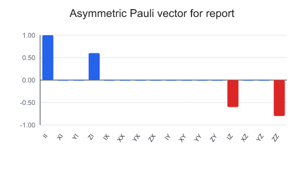

This kind of figure suits reports with limited layout space. During debugging, using the default figure first is still recommended, so that color, transparency and size settings interfere less with reading the figure.

---

## Key points for checking state figures

- Confirm whether the state comes from circuit simulation, direct construction or noise evolution;
- For single-qubit states, prefer the Bloch figure to explain the direction;
- For multi-qubit entangled states, do not look only at single-qubit Bloch vectors;
- For multi-qubit figures, confirm the bit order, basis labels and Pauli string order first;
- Density matrix figures suit explaining coherence terms and mixed states;
- Pauli vectors suit connection to observables and expectation values.
- Unlike result figures, state figures show the quantum state itself, simulated or constructed; real hardware usually provides only sampling results directly, unless a separate tomography or estimation workflow exists.

---

## Next steps

- [Visualizing execution results](6_result_visualization.md): compare state figures with sampling results to distinguish simulated state structure from the actual bitstring distribution.
- [Notebook and documentation integration](3_notebook_and_docs.md): save state figures and the generating code into a documentation asset directory that can be rerun.
- [Visualization strategies for complex circuits](4_visualization_practices.md): return to the circuit structure and check whether an anomaly in a state figure comes from gate order, mapping or module decomposition.
