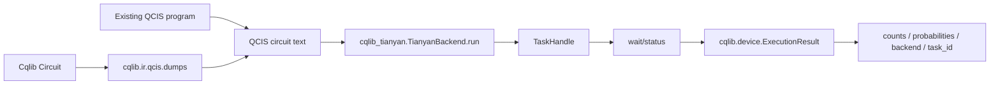
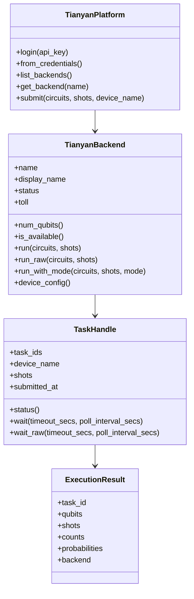

# Tianyan quantum cloud platform client overview

`cqlib-tianyan` is the client library in the Cqlib ecosystem used to connect to the Tianyan quantum cloud platform. Its responsibility is not to construct the quantum circuits themselves, but to submit already prepared quantum circuits to cloud quantum backends and to convert the task results returned by the cloud into the Cqlib unified `ExecutionResult` object.

From the usage chain, it sits between "circuit construction / IR conversion" and "cloud execution / result retrieval":



## 1. Module role

`cqlib-tianyan` mainly provides the following capabilities:

| Capability | Corresponding object | Description |
|---|---|---|
| Platform authentication | `TianyanPlatform.login`, `from_credentials` | Log in with an API Key, with local credential storage and automatic refresh |
| Backend discovery | `list_backends`, `get_backend` | Obtain available quantum backends, device status, billing type and qubit count |
| Device configuration | `TianyanBackend.device_config` | Download device information such as topology, calibration and readout error, returning a `cqlib.device.Device` |
| Task submission | `run`, `run_raw`, `run_with_mode`, `submit` | Submit QCIS circuits, with batch submission support |
| Result retrieval | `TaskHandle.status`, `wait`, `wait_raw` | Query task status, block until results are available, and return the Cqlib unified result object |
| Readout error correction | `CalibrationMode` | Correct measurement counts for readout error based on device calibration data |

## 2. Relationship with other Cqlib modules

The relationship between `cqlib-tianyan` and the Cqlib core modules is as follows:

| Module | Role in the Tianyan execution chain |
|---|---|
| `cqlib.circuit` | Build local quantum circuits |
| `cqlib.ir.qcis` | Convert a `Circuit` into QCIS text, or load existing QCIS text |
| `cqlib_tianyan` | Log in to the platform, select a backend, submit QCIS and poll for results |
| `cqlib.device` | Carry device configuration and execution results, such as `Device` and `ExecutionResult` |
| `cqlib.visualization` | Inspect the circuit structure before submission and check whether the circuit matches expectations |

Recommended workflow:

```text
Circuit construction
-> QCIS export
-> Tianyan backend submission
-> TaskHandle waits for results
-> ExecutionResult analysis
```

## 3. Installation and environment

The Python package name is `cqlib-tianyan`, and the import module name is `cqlib_tianyan`.

```bash
pip install cqlib-tianyan
```

To install from source for development:

```bash
cd crates/binding-python
maturin develop
```

`cqlib` must be installed as well, because the result object returned by the Tianyan client is `cqlib.device.ExecutionResult` and the device configuration object is `cqlib.device.Device`.

## 4. Minimal example

```python
import os
from cqlib_tianyan import TianyanPlatform

platform = TianyanPlatform.login(os.environ["TIANYAN_API_KEY"])
backend = platform.get_backend("tianyan-287")

qcis = "H Q1\nM Q1"
task = backend.run([qcis], shots=1000)

results = task.wait(timeout_secs=120.0, poll_interval_secs=5.0)
result = results[0]

print(result.task_id)
print(result.counts)
print(result.probabilities)
```

This example does four things:

1. Log in to the platform with the API Key from an environment variable.
2. Select a backend device.
3. Submit one QCIS circuit.
4. Wait for the task to complete and read the measurement counts.

## 5. Core object relationships



## Next steps

- [Authentication and configuration](1_auth_config.md): learn about API Key login, credential storage, custom domains and configuration options.
- [Backend and device configuration](2_backend_device.md): learn about backend lists, status checks, device topology and calibration configuration.
- [Task submission and result retrieval](3_task_result.md): learn about submitting QCIS, batch tasks, polling and the result object.
- [QCIS and IR integration](4_qcis_ir_workflow.md): learn how to export QCIS from a Cqlib `Circuit` and submit it to Tianyan.
- [Readout error correction](5_readout_mitigation.md): learn about `CalibrationMode` and the difference between corrected and raw results.
