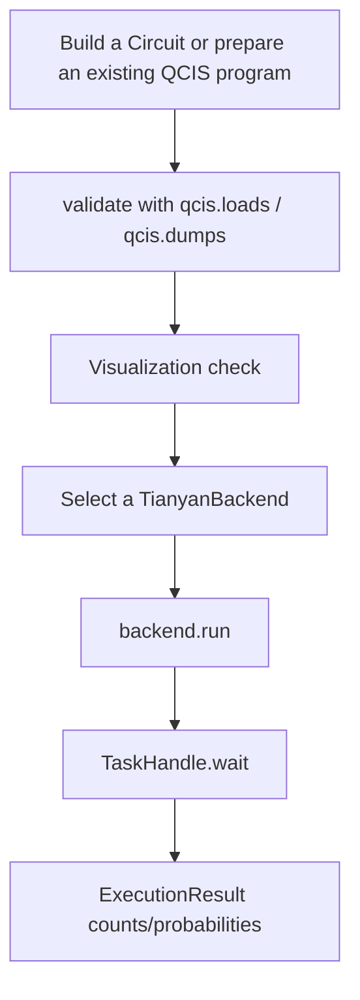

# QCIS and IR integration

Tianyan platform task submission uses QCIS circuit text. Therefore, there are usually two ways to prepare submission content in Cqlib:

- Use existing QCIS program text, such as QCIS generated by a hardware-side toolchain, a historical experiment file or an external system.
- Build the circuit with `cqlib.circuit.Circuit` first, then export QCIS through `cqlib.ir.qcis.dumps`.

This page focuses on the second way, because it links Cqlib circuit construction, visualization, IR conversion and Tianyan execution into a complete flow.

## 1. From Circuit to QCIS

```python
from cqlib import Circuit
from cqlib.ir import qcis

circuit = Circuit(2)
circuit.h(0)
circuit.cz(0, 1)
circuit.measure(0)
circuit.measure(1)

qcis_text = qcis.dumps(circuit)
print(qcis_text)
```

Possible output:

```text
H Q0
CZ Q0 Q1
M Q0
M Q1
```

## 2. Submitting the exported QCIS

```python
import os
from cqlib import Circuit
from cqlib.ir import qcis
from cqlib_tianyan import TianyanPlatform

circuit = Circuit(2)
circuit.h(0)
circuit.cz(0, 1)
circuit.measure(0)
circuit.measure(1)

qcis_text = qcis.dumps(circuit)

platform = TianyanPlatform.login(os.environ["TIANYAN_API_KEY"])
backend = platform.get_backend("tianyan-287")

task = backend.run([qcis_text], shots=1000)
results = task.wait(timeout_secs=120.0)

print(results[0].counts)
```

## 3. Validating QCIS before submission

If the QCIS comes from an external system, a historical experiment file or manually written program text, it is recommended to parse it once with Cqlib IR first:

```python
from cqlib.ir import qcis

qcis_text = "H Q1\nM Q1"
circuit = qcis.loads(qcis_text)

print(circuit.num_qubits)
print(len(circuit.operations))
```

If `qcis.loads` fails, the text itself may not conform to the QCIS support scope of the current Cqlib, and direct submission to the cloud is not recommended.

## 4. Visualization check

Before submission, the circuit can be inspected with the Cqlib visualization module:

```python
from cqlib.ir import qcis
from cqlib.visualization import draw_text

circuit = qcis.loads("H Q1\nM Q1")
print(draw_text(circuit))
```

This step is suitable for troubleshooting:

- Whether the qubit numbering is correct.
- Whether the gate order is correct.
- Whether measurement is present.
- Whether the circuit matches expectations.

## 5. QCIS gate set boundaries

`qcis.dumps(circuit)` rejects circuits that cannot be represented as QCIS. Common cases:

| Case | Description | Handling |
|---|---|---|
| Custom `CircuitGate` | QCIS does not express user-defined gates directly | Call `decompose()` first |
| Arbitrary-matrix `UnitaryGate` | QCIS is gate instruction text and does not store arbitrary matrices | Decompose into basic gates first |
| Complex control flow | QCIS does not express general classical control flow | Switch to another format or compile and expand first |
| Ordinary identity gate | `I Qn t` in QCIS means delay, not an ordinary identity gate | Do not treat an ordinary I as a QCIS delay |
| Global phase | Hardware instructions generally do not need a global phase | Remove or ignore it before submission |

## 6. Physical qubit numbering

Tianyan QCIS uses physical qubit numbering, for example:

```text
H Q1
M Q1
```

Here `Q1` is a physical qubit number, and it is not necessarily equal to the first logical qubit in the local logical circuit. Before actual submission, the target device topology and available qubits need to be confirmed.

If a local circuit is constructed directly with `Circuit(2)` and then exported to QCIS, the default result is `Q0`, `Q1`. If the target device is expected to use specific physical qubits, for example `Q1`, `Q8`, this needs to be handled explicitly at the construction or mapping stage.

Hand-writing QCIS that specifies physical qubits:

```python
qcis_text = "H Q1\nH Q8\nCZ Q1 Q8\nH Q8\nM Q1\nM Q8"
```

This example uses `H + CZ + H` to implement a CNOT structure equivalently on the target qubits.

## 7. Relationship with OpenQASM

If an OpenQASM circuit already exists, it can be converted into a `Circuit` through Cqlib IR first, and then exported to QCIS:

```python
from cqlib.ir import qasm3, qcis

qasm3_text = """
OPENQASM 3.0;
include "stdgates.inc";
qubit[2] q;
h q[0];
cz q[0],q[1];
"""

circuit = qasm3.loads(qasm3_text)
qcis_text = qcis.dumps(circuit)
```

Note: the conversion succeeds only when the gates and semantics in the OpenQASM circuit can be expressed by QCIS.

## 8. Recommended execution flow



## 9. Engineering recommendations

- Save the original `Circuit`, the exported QCIS and the final result for key experiments.
- When external QCIS program text is used, parse and validate it with `qcis.loads` first.
- Before using physical qubits, check `backend.device_config()` first.
- If QCIS export fails, do not force string concatenation; prefer to return to the circuit decomposition or compilation stage.
- Keep `task.task_ids` for cloud tasks to facilitate later tracking.

## Next steps

- [Readout error correction](5_readout_mitigation.md): obtain corrected measurement results based on device calibration data.
- [QCIS format description](../1_ir/1_qcis.md): learn about the support scope of Cqlib for QCIS instructions, import and export.
